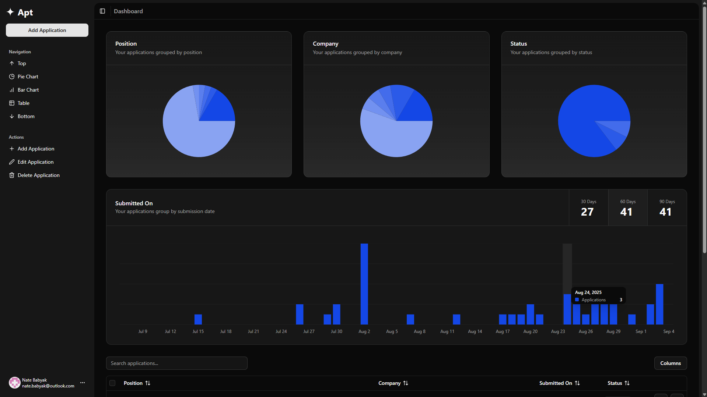

    
    <h1>Apt</h1>
    <h3>Track and optimize your job search from a single, powerful dashboard</h3>

## Built With

## Usage

### Features

- User authentication
- Add applications
- Interactive charts
- Applications table
  - Searching
  - Sorting
  - Editing
  - Deleting
  - Pagination

## Roadmap

### Version 1.0.0

- [x] Dashboard
  - [x] Sidebar
  - [x] Charts
  - [x] Table
- [x] Landing Page

## Acknowledgements

- 
- 
- 
- 
- [NextAuth.js](https://next-auth.js.org/)
- [SQLModel](https://sqlmodel.tiangolo.com/)

## License

[MIT](LICENSE.txt)
