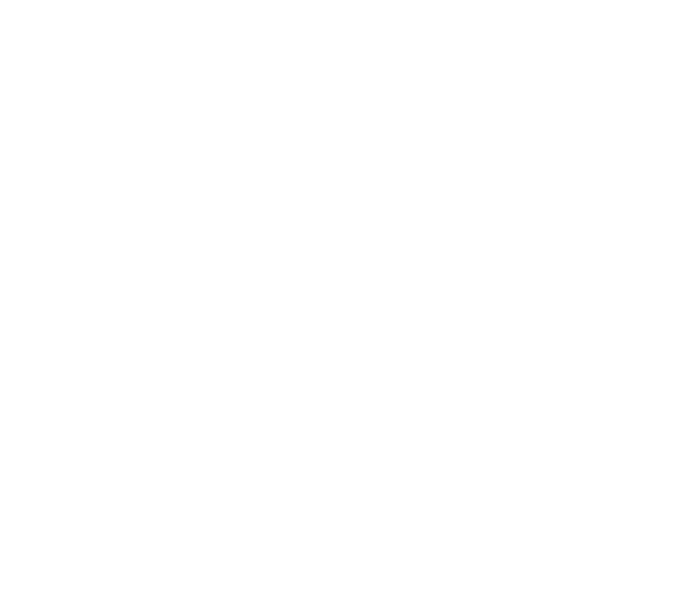

    
    <h1>Apt</h1>
    <h3>Track and optimize your job search from a single, intuitive dashboard</h3>

    <h2>Built With</h2>
    
    
    
    <h3>And</h3>

[NextAuth.js](https://next-auth.js.org/)
